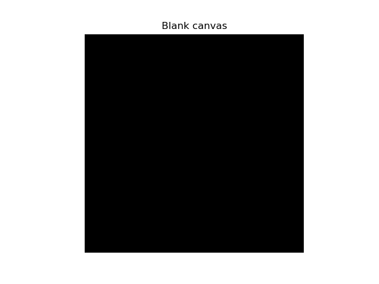
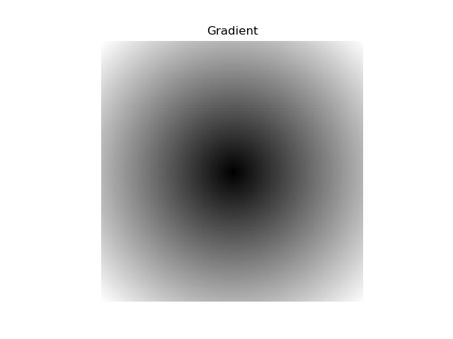
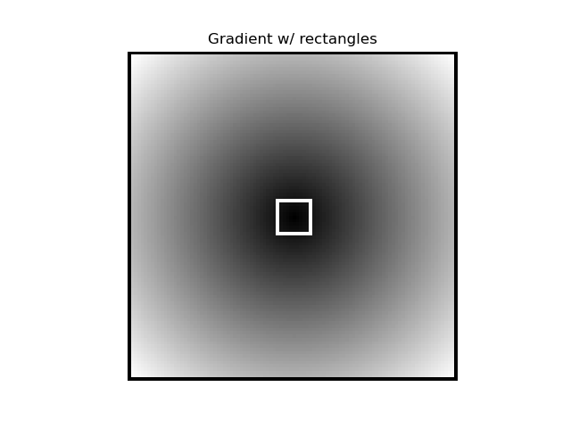
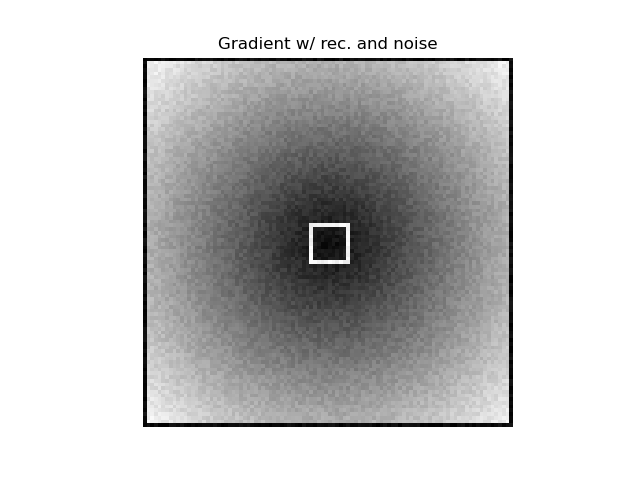
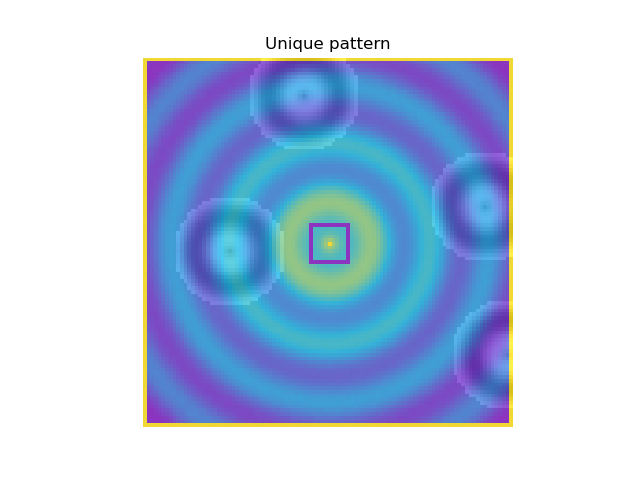

# Assignment 1: NumPy Array Manipulation for 2D Pattern Generation

[View on GitHub]({{ site.github.repository_url }})

---

## Repository structure

```
A1/
├── index.md                    
├── README.md                   
├── BRIEF.md                    
├── pattern_generator.py        
└── images/                     
    |── Generated images       
```
---

# Documentation

## Table of Contents

- [Pseudo-Code](#pseudo-code)
- [Technical Explanation](#technical-explanation)
- [Results](#results)
- [References](#references)

---

## Pseudo-Code

**Initialize Variables**
- *Purpose of step: Initialization*
- Set canvas width and height
- Define image center point
- Define number of attractors and influence radius
- Define three fixed colors for the palette 

**Create Base Spatial Field**
- *Purpose of step: Establish a continuous background structure*
- For each pixel, compute distance from the image center
- Use distance to create a smooth radial gradient
- Add a gentle oscillation to introduce variation

**Apply Geometric Constraints**
- *Purpose of step: Introduce rigid geometry to contrast the smooth field*
- Set outer boundary of the image to minimum intensity
- Insert a centered, unfilled rectangular shape

**Normalize and Stabilize Field**
- Normalize values to a fixed range
- Adjust brightness to smooth transitions
- Add minimal noise for subtle texture

**Map Field to Limited Color Palette**
- Convert normalized field into blending weights
- Blend smoothly between three predefined colors

**Generate Attractor Influences**
- *Purpose of step: Add localized variation without disrupting global structure*
- Randomly place attractor points in the image
- For each attractor:
  - Compute distance to all pixels
  - Apply a smooth, distance-based modulation within a fixed radius

**Compose Final Image**
- Combine color blending and attractor modulation
- Clamp values to valid display range

---
## Technical Explanation
In this assignment, I generated a 2D pattern using `NumPy` for array-based computation and `Matplotlib` for visualization. The process begins by defining a square canvas `(h = w = 100)` and establishing a 2D coordinate grid. The center of the image is used as a reference point for computing spatial relationships.

A radial distance field is calculated by computing the Euclidean distance of each pixel from the image center. This distance field serves as the main continuous structure of the image. A smooth radial gradient is derived from this field using a nonlinear transformation, and a low-frequency sine modulation is added to introduce variation and prevent visual flatness.

Geometric constraints are then applied to the gradient. The outermost pixels are set to a uniform minimum value, creating a clear frame that visually bounds the composition. Additionally, a centered, unfilled rectangular shape is introduced by assigning maximum intensity values along its edges, creating a rigid geometric contrast against the smooth radial background.

The gradient is normalized to the range `[0, 1]` to ensure stable subsequent processing. A slight nonlinear brightness adjustment is applied to improve smoothness in intensity transitions. Small-amplitude, distance-weighted noise is then added to introduce subtle texture without overwhelming the overall structure.

Rather than directly mapping intensity values to grayscale, a limited three-color palette is defined. The normalized gradient values are converted into smooth blending weights, which control how much each of the three colors contributes at every pixel. This approach enables gradual color transitions while maintaining a restricted and intentional color scheme.

To introduce localized variation, four random attractor points are generated within the image. For each attractor, a distance-based sine modulation is applied to pixels within a fixed radius, subtly perturbing nearby colors. This adds localized visual interest while preserving the global structure of the image.

Finally, the resulting RGB values are clipped to ensure they remain within valid display ranges and visualized using `Matplotlib`’s `imshow()` function with axes disabled. The final image combines smooth radial structure, geometric framing, controlled color blending, and localized attractor-based modulation into a cohesive pattern.


## Results

In this section, I have inserted a few images to document different stages of my workflow. The images are inserted cronologically, and shows the development from a blank canvas to the the final image.

**Blank canvas:**



The initial blank canvas represents the starting point of the process, containing no structure or variation. This step establishes the image domain but does not yet contribute visual features.


**Gradient image**



The radial gradient image shows the continuous base structure of the pattern. Pixel intensity varies smoothly with distance from the center, producing concentric transitions that establish the global spatial organization of the image.


**Gradient image with squares using slicing operations**



By introducing a centered, unfilled square and a uniform outer frame, rigid geometric elements are added to the otherwise smooth gradient. This creates a clear contrast between continuous and discrete structures, which becomes an important visual theme in the final image.


**Gradient image with squares and random noise**



Adding low-amplitude noise introduces subtle irregularities to the gradient. While the overall structure remains intact, the noise reduces visual flatness and prevents overly uniform regions.


**Final pattern with color blending and attractors**


The final image combines the radial base field, geometric framing, limited color palette, and localized attractor-based modulation. Smooth color blending produces gradual transitions between hues, while the attractors introduce localized distortions that add visual complexity without disrupting the global structure. The result is a balanced composition that combines order and variation in a controlled manner.

Note that the images presented in this assignment are not refined for maximum visual polish. This is a deliberate choice, as the primary goal is to demonstrate control over the underlying computational methods rather than to produce a visually optimized result. Elements such as hard geometric boundaries and visible structural artifacts are therefore retained to make the individual components of the algorithm explicit. Producing more visually appealing and refined images will be a greater focus in subsequent assignments, where aesthetic decisions are emphasized more strongly.

## References

References are given below:

[1] Stack Overflow. What is the purpose of meshgrid in NumPy? https://stackoverflow.com/questions/36013063/what-is-the-purpose-of-meshgrid-in-numpy#:~:text=meshgrid%20helps%20in%20creating%20a,points%20from%20the%20two%20arrays.&text=Say%2C%20if%20your%20function%20just,achieved%2C%20efficiently%20for%20large%20arrays

[2] Matplotlib Documentation. imshow — Display data as an image
https://matplotlib.org/stable/api/_as_gen/matplotlib.pyplot.imshow.html

[3] Official NumPy Documentation. numpy.meshgrid — create coordinate matrices
https://numpy.org/doc/stable/reference/generated/numpy.meshgrid.html
