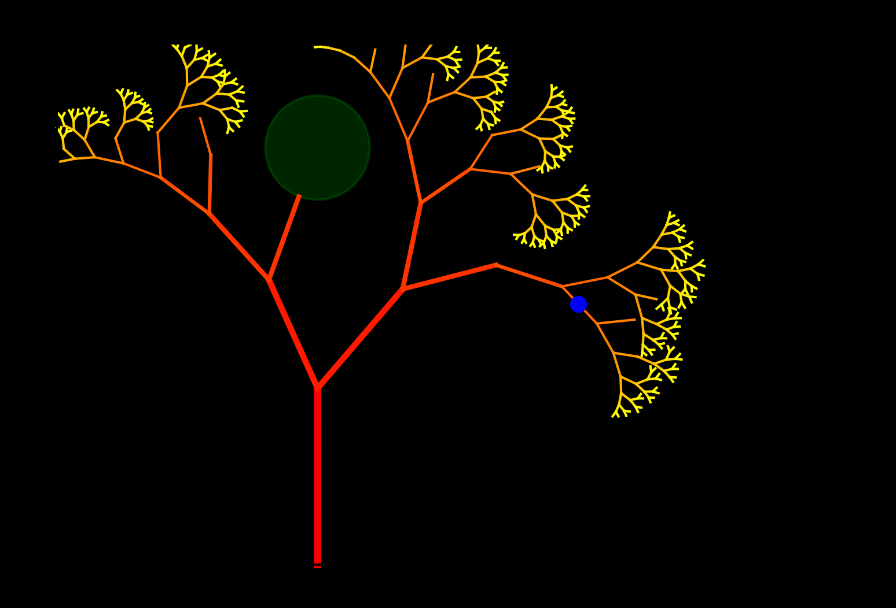
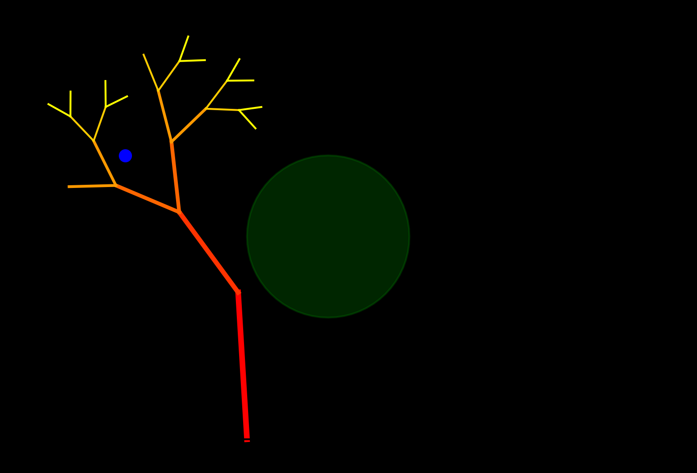
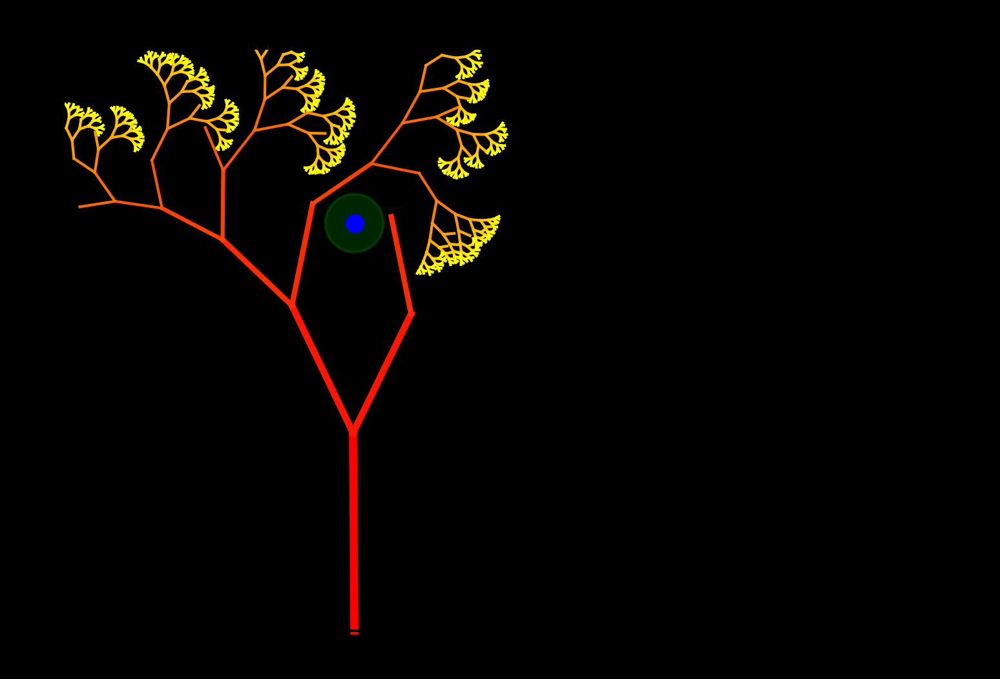
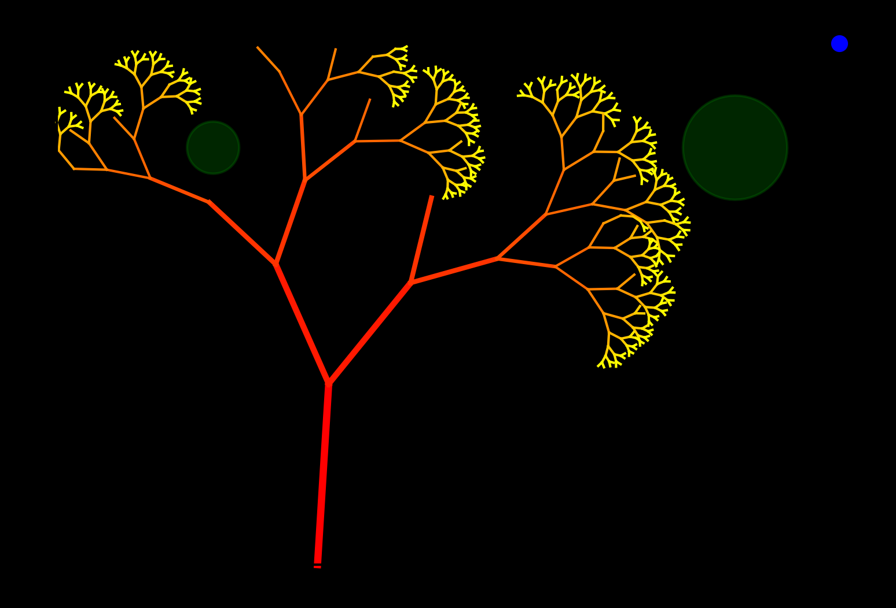
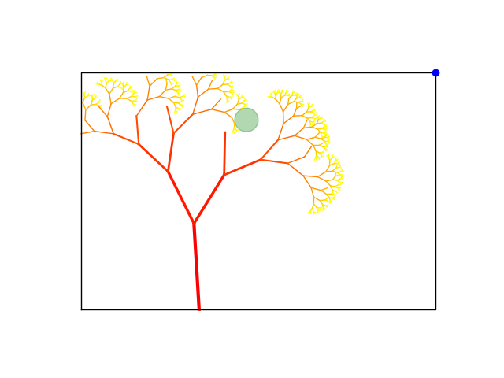
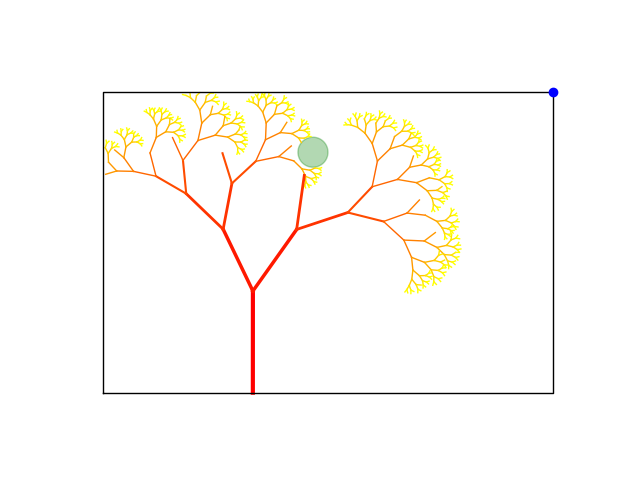
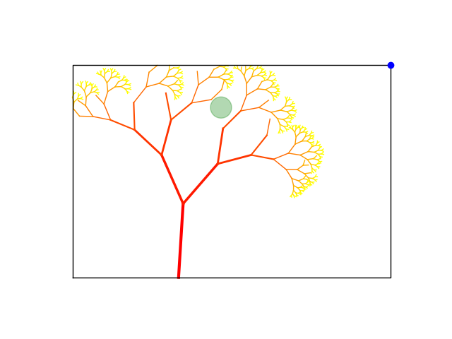

# Assignment 2: Exploring Fractals through Recursive Geometric Patterns

[View on GitHub]({{ site.github.repository_url }})


---

## Table of Contents

- [Repository structure](#Repository-structure)
- [Pseudo-Code](#pseudo-code)
- [Technical Explanation](#technical-explanation)
- [Geometric Influences](#geometric-influences)
- [Parameters & Seeds](#parameters--seeds)
- [Appearance Mapping](#appearance-mapping)
- [Experiments](#experiments)
- [Challenges and Solutions](#challenges-and-solutions)
- [References](#references)


## Repository structure

```
A2/
├── index.md             
├── README.md                  
├── BRIEF.md                    
├── fractal_generator.py  
└── images/          
    ├── Generated images
```
---


## Pseudo-Code

Here, a detailed pseudo-code is provided. 


**Initialize Parameters:**

Set `start_point = (0,0)`

Set `initial_angle = 90`

Set `initial_length = 50`

Set `recursion_depth = 0`

Set `max_recursion_depth = x`

Set `angle_change = 30`

Set `length_scaling_factor = 0.7`

Set `attractor_point = (x,y)`

Define allowed region polygon `allowed_region`

Define obstacle polygon(s) `obstacles`

Seed randomness: `random.seed(x)`

**Define "Helper" Functions:**

`is_within_region(point)` → returns True if point inside `allowed_region`

`intersects_obstacles(line)` → returns True if line intersects any obstacle

`intersects_self(line)` → returns True if line crosses any existing line in `line_list`


**Define Main Function** `generate_fractal(start_point, angle, length, depth, max_depth, angle_change, length_scaling_factor)`

- **Process:**
  - **1. Check recursion limit:**
  
    If `depth` > `max_depth` → return

- **2. Add randomness:**
  
  `angle_variation = angle + random small variation`

  `length_variation = length * (length_scaling_factor + small random variation)`

- **3. Calculate end point using trigonometry:**

  `end_x = start_x + length_variation * cos(radians(angle_variation))`

  `end_y = start_y + length_variation * sin(radians(angle_variation))`

  `end_point = (end_x, end_y)`

- **4. Apply attractor influence:**

  Compute vector to attractor: `dx = attractor_x - end_x, dy = attractor_y - end_y`

  Compute `angle_to_attractor = atan2(dy, dx)` in degrees

  Adjust angle: `angle_variation += influence_strength * (angle_to_attractor - angle_variation)`

- **5. Create line segment:**

  `line = LineString([start_point, end_point])`

- **6. Check rules:**

  If `end_point` is outside allowed region → return

  If `line` intersects any obstacle → return

  If `line` crosses any existing branch → return

- **7. Store line segment:**

  Append `(line, depth)` to `line_list`

- **8. Recursive branching:**

  `next_depth = depth + 1`

  Left branch: call `generate_fractal(end_point, angle_variation + angle_change, length_variation, next_depth, max_depth, angle_change, length_scaling_factor)`

  Right branch: call `generate_fractal(end_point, angle_variation - angle_change, length_variation, next_depth, max_depth, angle_change, length_scaling_factor)`

- **9. Return after recursive calls**


**Main Execution:**

1. Clear line_list

2. Call `generate_fractal(start_point, initial_angle, initial_length, recursion_depth, max_recursion_depth, angle_change, length_scaling_factor)`


**Visualization:**

1. Create figure and axes using Matplotlib

2. Plot fractal lines:
    
  - For each `(line, depth)` in `line_list`

    - Extract `x, y` coordinates

    - Plot line with color based on `depth` and linewidth decreasing with `depth`

3. Plot domain boundary:

  - Extract `x, y` from `allowed_region.exterior`

  - Plot as black line

4. Plot obstacles:

  - For each obstacle, extract `x, y` from `.exterior`

  - Fill with semi-transparent color

5. Plot attractor point:

  - Plot blue dot at `(attractor_point[0], attractor_point[1])`

6. Set aspect ratio equal, turn off axes

7. Show figure

8. Save figure as PNG


---

## Technical Explanation

The fractal is generated by the recursive function `generate_fractal`, which draws a line from a start point to a new end point computed using trigonometric functions based on angle and length. At each step, the length is scaled by `length_scaling_factor` and the angle is varied by a small random offset plus the fixed branching value `angle_change`. The angle is further adjusted toward the `attractor_point` to introduce directional pull.

In addition to fixed branching angles, a small random angular jitter is applied at each recursion step. This per-branch angle perturbation prevents perfect symmetry and introduces local variation while preserving the overall fractal structure.

Before a new line is accepted, three constraint functions are applied:

`is_within_region(end_point)` ensures the point stays inside the allowed region.

`intersects_obstacles(line)` prevents drawing into blocked areas.

`intersects_self(line)` prevents the fractal from crossing itself.

If the line passes all checks, it is stored in `line_list`, and the function recursively calls itself twice to create branching. This produces a self-similar fractal pattern with controlled randomness, geometric constraints, and attractor-guided curvature.

---

## Geometric Influences

Two geometric influences used in the fractal growth are:

1. **Attractor Influence**

The fractal is guided toward a target point `(attractor_point)`.
In each recursion step, the direction of the branch is adjusted by measuring the angle from the new endpoint to the attractor using `atan2`. The current branch angle is then moved slightly toward that angle:

` angle_to_attractor = math.degrees(math.atan2(dy, dx))`

`angle_variation += influence_strength * (angle_to_attractor - angle_variation)`

This occurs before the recursive calls, causing the entire structure to bend gradually toward the attractor.

2. **Region-Aware Growth and Obstacle Avoidance**

The growth is constrained to an allowed region and must avoid circular obstacles.
Before adding a new line, three rules are applied:

`if not is_within_region(end_point):`
    `return`

`if intersects_obstacles(line):`
   ` return`

`if intersects_self(line):`
    `return`

- `is_within_region()` prevents growth outside the polygon boundary.

- `intersects_obstacles()` prevents lines from entering obstacle areas.

- `intersects_self()` ensures branches do not cross previous branches (self-avoidance).

These checks occur immediately after computing the line and before recursion, shaping the fractal around space limitations.

This combination results in a branching structure that bends toward a target, avoids forbidden areas, and maintains non-overlapping geometry.

---

## Parameters & Seeds

| Figure | Seed | Attraction point | Obstacle, circle (x,y) r | Depth |
|---|---|---:|---:|---:|
| 1 | 50 | (50,50) | (0,80) 10 | 10 |
| 2 | 0 | (-30,70) | (20,50) 20 | 5 |
| 3 | 30 | (0,70) | (0,70) 5 | 12 |
| 4 | 100 | (100,100) | (80,80) 10 & (-20,80) 5 | 10 |

This assignment produced four images "fractal_var_i" , i=1..4. The table above shows which parameters were changed for each image, resulting in various outcomes. All obstacles were circles, where (x,y) and r respectively indicate the central coordinate and radius of the circle. Note that for figure 4 (fractal_var4), two circular obstacles were added.

Below, the images described by the table above are shown. The parameters and seeding clearly result in four distinct images:

**Figure 1: `fractal_var1`**


**Figure 2: `fractal_var2`**


**Figure 3: `fractal_var3`**


**Figure 4: `fractal_var4`**


---

## Appearance Mapping

Color and line width are mapped to recursion depth.
For each line, `depth / max_depth` is used to select a color from a colormap, so branches become lighter as they get smaller.
Line width decreases with depth, making earlier (thicker) branches visually dominant and later branches appear more delicate:

`color_mod = plt.cm.autumn(depth / max_recursion_depth)`
`linewidth_mod = max(1.0, 3.0 - depth*0.5)`

This highlights the hierarchical structure of the fractal and makes the branching progression easy to see.

---

## Experiments

Under the section "Parameters and seeds" a table is shown, explaining the parameter-variation of each image. The parametric variation resulted in four distinct images. Below, a brief summary of each parameters geometric influence is given:

1. **Stochastic variation (seeding)**

    Changing the seeding influences the micro-geometry, producing small variations in the branching-structure of the fractal. More on this later.

2. **Maximum recusion depth**

    The maximum recursion depth determines the overall complexity of the fractal. Higher depth results in richer detail, while lower depth produces a more simplified image. Reaching higher recursion depths could be limited by the constraints given in `allowed_region`.

3. **Attractor point**
    The attractor point provides a global bias that directs growth and modifies overall curvature. The level of attraction is simply modified by changing the float-number in `influence_strength`.

4. **Obstacles**
    
    Obstacles serve as pruning mechanisms that reshape branching patterns and introduce asymmetry. For lage fractal-structures where self-overlapping is permitted, the effect of the obstacle(s) would be clearer.


Furthermore, an experimental examination of the effect of seeding has been carried out.
The subfolder "experiments" located in the "images" folder contains three images "Fig_1", "Fig_2" and "Fig_3" with the same parameters but different seeds. The seeds for the three figures were 0, 50 and 100 respectively. The variation in the images is quite small, since only the change of angle and length at each branching was affected by the inclusion of randomness. The stochastic variation was limited due to a *controlled* addition of randomness in `angle_variation`and  `lenth_variation `. Expanding the size of the interval in the `random.uniform`  function  would increase the stochastic variation. In general, changing only the random seed leads to different fine-scale geometry while keeping the overall structural form. This confirms that the fractal is sensitive to random perturbations but still follows basic growth rules.

**Experiment 1 `Fig_1`: Seed 0**




**Experiment 2 `Fig_2`: Seed 50**




**Experiment 3 `Fig_3`: Seed 100**




---

## Challenges and Solutions

- **Challenge**: Ensuring no intersection between branches, but still producing a code that results in an image containing multiple branches. 

  - **Solution**: In line 48 of the code, originally i had written:
  `def intersects_self(line):`
    `"""Check if a line crosses any existing line in the fractal"""`
    `return any(line.intersects(existing_line) for existing_line, _ in line_list)`

    After almost an hour of debugging, the problem was identified. In the above code, "intersects" was replaced with "crosses" making the current code:

    `def intersects_self(line):`
    `"""Check if a line crosses any existing line in the fractal"""`
    `return any(line.crosses(existing_line) for existing_line, _ in line_list)`

    When using "intersects", Python interpreted a junction of lines as an intersection resulting in just one line.

    Furhtermore the `influence_strenght` on line 76 was reduced, leading to smaller variations in angle changes for the branches.

    In general, the complexity of the rendered images were limited due to the "no self-overlapping" requirement.

- **Challenge**: Rendering images
  - **Solution**: Restricted the `max_recursion_depth` of the fractal to a maximum of 12 in order to reduce computational effort. Values above this limit resulted in long computation time and did not produce any images.

---

## References

- **ChatGPT**: Used for debugging

- **Existing code and slides (W05)**: Used for inspiration

- **MatplotLib**: 

  https://matplotlib.org/stable/api/_as_gen/matplotlib.pyplot.plot.html

  https://matplotlib.org/stable/api/_as_gen/matplotlib.figure.Figure.set_facecolor.html