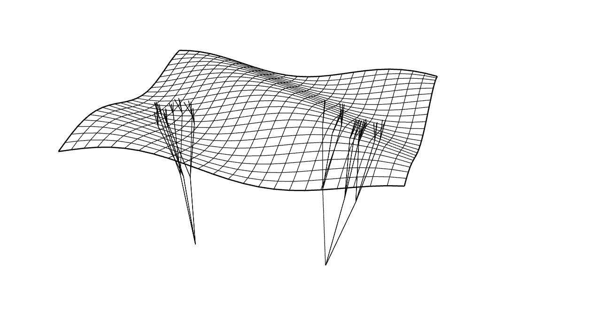
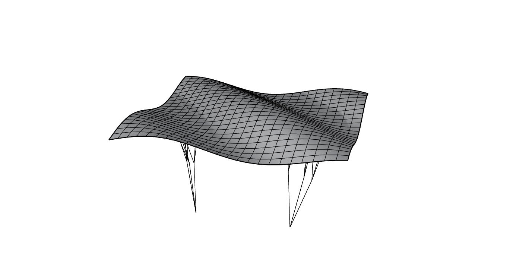
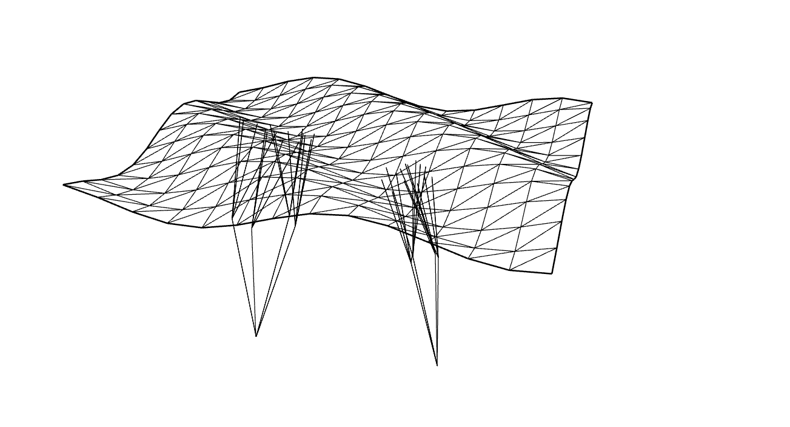
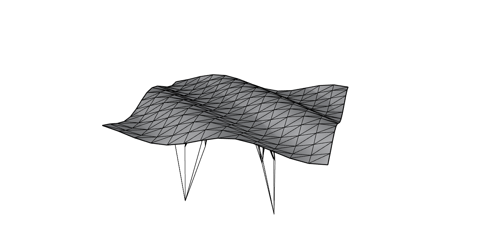
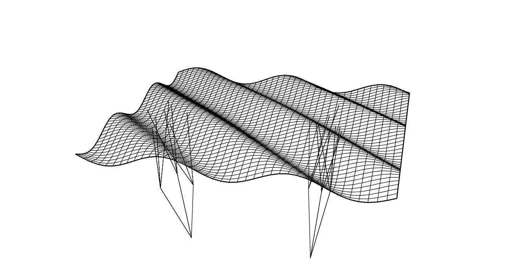
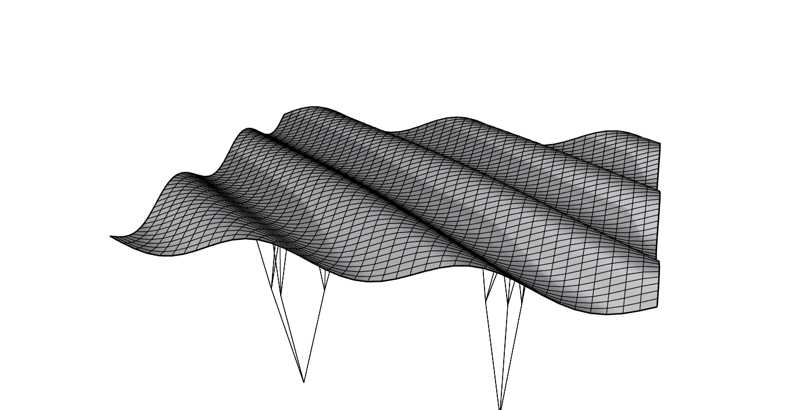

# Assignment 3: Parametric Structural Canopy

[View on GitHub]({{ site.github.repository_url }})


## Table of Contents
- [Pseudo-Code](#pseudo-code)
- [Technical Explanation](#technical-explanation)
- [Design Variations](#design-variations)
- [Challenges and Solutions](#challenges-and-solutions)
- [References](#references)
- [AI Acknowledgments](#ai-acknowledgments)


---

## Pseudo-Code

Here, a detailed pseudo-code is given explaining the logic of the script. The more technical aspects of the code is given in the section "Technical explanation".

First, the general steps taken to construct the structural canopy are briefly introduced:

```python
# 0. Prepare inputs.
base_surface -> NURBS surface to sample

divU, divV -> surface sampling resolution

amplitude, frequency, phase -> heightmap controls

rec_depth, br_length, len_reduct, n_branches -> branching controls

use_quad -> Boolean, choose quad or triangular tessellation

seed -> random seed for reproducibility


# 1. Set random seeds for reproducibility
seed_everything(seed)

# 2. Create uniform grids of normalized U and V
U, V = uv_grid(divU, divV)

# 3. Compute heightmap - controls surface deformation with sine-waves and Gaussian bump
H = heightmap(U, V, amplitude, frequency, phase)

# 4. Sample points on base surface - maps normalized UV grid to actual 3D points on the surface
P0 = sample_point_grid_from_surface(base_surface, U, V)

# 5. Deform points along normals - offsets each point along its surface normal based on heighmap
P_def = manipulate_points_along_normals(P0, H, base_surface, U, V)

# 6. Lift points vertically - adds a constant vertical offset (10) to all points
P_def_lifted = lift_point_grid(P_def, 10)

# 7. Build canopy surface - NURBS surface creation from point grid
surf = surface_from_point_grid(P_def_lifted)

# 8. Tessellate surface into mesh (either quad or triangular)
if use_quad:
    mesh = mesh_from_grid_quad(P_def_lifted)
else:
    mesh = mesh_from_grid_tri(P_def_lifted)

# 9. Select support root points
roots = two_center_support_roots(surf)

# 10. Generate recursive supports - branching supports from root points toward canopy

# 11. Set component outputs

```
Below, a more detailed explanation of the used functions is given.


#### `seed_everything(seed)`

**Description**: Sets the random seed to ensure reproducibility of random processes (branch jitter, randomness in support growth).

**Inputs**: `seed`

**Pseudo-code**:
```python
if seed is not None:
    set random generator seed
```

---

#### `uv_grid(divU, divV)`

**Description**: Generates two 2D arrays representing normalized UV coordinates in [0,1] for sampling surfaces.

**Inputs**: 
- divU -> number of divisions along U direction
- divV -> number of divisions along V direction

**Outputs**
- U, V -> 2D arrays of shape (divV, divU) (meshgrid)

**Pseudo-code**:
```python
create array U with values 0..1, length = divU
create array V with values 0..1, length = divV
return 2D meshgrid (U, V)
```
---
#### `heightmap(U, V, amplitude, frequency, phase)`

**Description**: Generates a scalar displacement field H using a combination of a sine wave and a Gaussian bump. Controls how points are offset along normals.

**Inputs**: 
- U, V -> normalized 2D grids
- amplitude, frequency, phase -> numeric GH sliders controlling wave and bump

**Outputs**
- H -> 2D array of same shape as U, V

**Pseudo-code**:
```python
compute a sine wave based on (U + V)
compute distance from grid center
compute Gaussian bump at center
combine wave and bump
scale result by amplitude
return height matrix H
```
---


#### `sample_point_grid_from_surface(surface_id, U, V)`

**Description**: Converts normalized UV grids into 3D points sampled on a Rhino surface.

**Inputs**: 
- surface_id -> Initially drawn Rhino-surface
- U, V -> normalized 2D UV grids

**Outputs**
- P -> 2D list of 3D points (same shape as U,V)

**Pseudo-code**:
```python
get Rhino surface U-domain
get Rhino surface V-domain

initialize 2D list P with same shape as U,V

for each (i,j):
    convert normalized u,v -> surface domain
    evaluate surface at (u,v)
    store XYZ point in P[i][j]

return P
```
---


#### `manipulate_points_along_normals(point_grid, H, surface_id, U, V)`

**Description**: Moves each point along its surface normal by the corresponding height in H.

**Inputs**: 
- point_grid -> 2D list of 3D points sampled from surface
- H -> 2D heightmap array
- surface_id -> Initially drawn Rhino-surface
- U, V -> normalized UV grids

**Outputs**
- R -> 2D list of displaced 3D points

**Pseudo-code**:
```python
get surface U-domain and V-domain

initialize 2D list R with same dimensions as H

for each (i,j):
    p = point_grid[i][j]
    convert (i,j) -> surface parameters
    n = surface normal at (u,v)
    if n invalid -> use (0,0,1)
    normalize n
    R[i][j] = p + n * H[i][j]

return R
```
---

#### `lift_point_grid(point_grid, lift)`

**Description**: Adds a constant vertical offset to every point in the grid.

**Inputs**: 
- point_grid -> 2D list of 3D points
- lift -> numeric height controlled by GH slider

**Outputs**
- New 2D list of 3D points with z increased by lift

**Pseudo-code**:
```python
for each row:
    for each point:
        add lift to z-coordinate

return lifted grid
```
---


#### `surface_from_point_grid(point_grid)`

**Description**: Builds a NURBS surface through a 2D grid of points.

**Inputs**: 
- point_grid -> 2D rectangular grid of 3D points

**Outputs**
- surf -> Rhino surface

**Pseudo-code**:
```python
rows = number of rows
cols = number of columns
flatten grid into 1D list of points
create NURBS surface with (rows, cols) and point list
return surface ID
```
---

#### `mesh_from_grid_tri(point_grid)`

**Description**: Generates a triangular mesh from a 2D point grid.

**Inputs**: 
- point_grid → 2D list of 3D points

**Outputs**
- mesh → Rhino mesh

**Pseudo-code**:
```python
initialize empty mesh

add mesh vertices for each grid point

for each cell (i,j):
    compute vertex indices a,b,c,d
    create triangular face (a,b,c)
    create triangular face (a,c,d)

compute normals
compact mesh
return mesh

```
---

#### `mesh_from_grid_quad(point_grid)`

**Description**: Generates a quad mesh from a 2D point grid.

**Inputs**: 
- point_grid -> 2D list of 3D points

**Outputs**
- mesh -> Rhino mesh 

**Pseudo-code**:
```python
initialize empty mesh

add mesh vertices for each grid point

for each cell (i,j):
    compute vertex indices a,b,c,d
    create quad face (a,b,c,d)

compute normals
compact mesh
return mesh
```
---


#### `two_center_support_roots(surface_id)`

**Description**: Selects two base points on the surface for support branches.

**Inputs**: 
- surface_id -> NURBS surface id

**Outputs**
- List of two 3D points

**Pseudo-code**:
```python
define two normalized UV positions

for each UV:
    convert normalized -> surface domain
    evaluate surface -> XYZ point
    append to roots list

return roots
```
---


#### `generate_supports(roots, depth, length, reduction, branches, seed, canopy_surf)`

**Description**: Recursively grows branching supports from anchor roots toward the canopy.

**Inputs**: 
- roots → list of anchor 3D points
- depth → recursion depth
- length → initial branch length
- reduction → factor to shrink length each recursion
- branches → number of child branches per node
- seed → random seed
- canopy_surf → NURBS canopy surface

**Outputs**
- supports -> list of line objects in Rhino

**Pseudo-code**:
```python
seed randomness

extract naked edges from surface
join edges into closed curve
get points on boundary
project those points to XY plane
build closed XY polyline
delete original boundary curve

define recursive function grow(point, depth, length):

    if depth <= 0:
        stop

    for number of branches:
        find closest point on canopy surface
        compute direction toward canopy
        apply random jitter
        compute branch end point

        project end point to XY plane

        if end point not inside flat boundary:
            skip branch

        check if branch intersects canopy:
            if yes:
                trim branch to intersection
                store line
                continue

        create full-length branch line
        store line
        grow(new_end, depth-1, length*reduction)

for each root in roots:
    start recursion from (x,y,0)

return all support lines
```
---


## Technical Explanation

This section contains a techincal explanation of the code with particular focus on the used functions.

**1. Heightmap Generation**

The heightmap is a 2D scalar field computed using NumPy arrays over the normalized UV grid. A combination of a sinusoidal wave and a Gaussian bump produces smooth variations in height across the canopy surface. Control parameters such as `amplitude`, `frequency`, and `phase` allow the user to adjust the intensity and frequency of surface undulations.

Reference function: `heightmap(U, V, amplitude, frequency, phase)`


**2. Point Grid Creation**

The code creates a 2D point grid by sampling an existing Rhino NURBS surface (`base_surface`). The normalized UV grid generated by `uv_grid(divU, divV)` is mapped to the surface domain to produce 3D coordinates for each grid point. This allows the heightmap to later deform points relative to the real surface geometry.

Reference function: `sample_point_grid_from_surface(base_surface, U, V)`


**3. Point Grid Manipulation**
Each point in the grid is offset along the corresponding surface normal by the value defined in the heightmap. To lift the canopy vertically, the function `lift_point_grid` is used.

Reference functions: `manipulate_points_along_normals(P_src, H, base_surface, U, V)` and `lift_point_grid(P_def, lift)`


**4. Surface Construction**

After manipulating the points, a NURBS surface is reconstructed from the deformed point grid. This creates a continuous 3D canopy surface that reflects both the heightmap displacement and the original surface curvature.

Reference function: `surface_from_point_grid(P_def_lifted)`


**5. Tessellation**

The surface is tessellated into either triangular or quadrilateral meshes. The grid of points is converted into a mesh by creating vertices at each grid point and forming faces between neighboring points. Triangular tessellation divides each quad cell into two triangles, while quadrilateral tessellation uses the four points directly.

Reference functions: `mesh_from_grid_tri(P_def_lifted)` and `mesh_from_grid_quad(P_def_lifted)`


**6. Support Structure Generation**

The canopy support structure is generated recursively from anchor points (roots). At each recursion step, a branch grows toward the canopy with random jitter applied to create natural variations. Each branch stops either when the maximum recursion depth is reached or when it intersects the canopy surface.

Reference function: `generate_supports(roots, rec_depth, br_length, len_reduct, n_branches, seed, surf)`

**Computational logics**

The model uses more than one computational logic. The canopy surface is generated through a heightmap that acts as a continuous field deforming a NURBS surface, while the support structure is created using a recursive branching process with randomness and geometric stopping rules. In addition, the surface can be tessellated using either triangular or quadrilateral meshes, which changes how the same geometry is discretized. These systems operate independently and can be varied separately, fulfilling the requirement of multiple computational logics.

**General**
A limitation of the current implementation is that the support structure is generated as line-based geometry, which represents structural intent rather than physical thickness. These simplifications were chosen to keep the focus on computational logic rather than structural detailing, and could be extended in future iterations.

---

## Design Variations

In this section the three images are presented. The images can of course also be find in the "images" folder. 

In the code, I have focused on the surface tessellation and less on the branching structures, as this was done in the previous assignment. The images are rendered using the "Wireframe" viewport, as this best captures the details of the mesh. It may not be the most visually pleasing way to present the canopys, but the level of detail in the figures are best presented in this way. 


### Parameter Tables
*(Provide the exact parameter sets and seeds used for each design. Add or remove columns to reflect your implementation.)*

| Design | amplitude | frequency | phase | divU | divV | rec_depth | br_length | len_reduct | n_branches | seed | Algorithm Notes |
|-------:|----------:|----------:|------:|-----:|-----:|----------:|----------:|-----------:|-----------:|-----:| ---------------:|
| A      | 1          |     1.2      |    0.7   |   24   |   24   |      3     |      5     |      0.8      |      3      |   28   |         quad        |  
| B      |      1     |     1.5      |   1.0    |   14   |   14   |      4     |      6     |      0.9      |      4      |   29   |        tri         |
| C      |     0.84      |     2.5      |   0    |   60   |   40   |     3      |     5      |      1.2      |       3     |   60   |        quad         |

Note: The column header "Algorithm Notes" explains whether a triangular or quad mesh was used. Changing the GH boolean component controls this.


1. **Variation A: `Var_A_Wireframe`and `Var_A_Shaded`**

   

   


2. **Variation B: `Var_B_Wireframe`and `Var_B_Shaded`**

   
   
   


3. **Variation C: `Var_C_Wireframe`and `Var_C_Shaded`**

   
   
      

---

## Challenges and Solutions

### General 
This was by far the hardest assignment of this course so far. Initially, I had a very clear idea of how I was going to solve this task. I wanted to:

1. Start from a base surface as shown in class
2. Create a UV grid on the base surface
3. Create a heightmap to determine the deformation
4. Choose a direction for the deformation of each point in the UV grid
5. Build a new surface from the deformed points
6. Tessellate the surface
7. Generate supportive branching structures

However, this turned out to be much more challenging than I had imagined, and I ended up spending 30+ hours on the assignment. In the next sub-section, the specific challenges I faced are explained.

### Specific challenges

#### Structurally storing points in nested lists (eg. `P = [[None for _ in range(cols)] for __ in range(rows)]`)

In order to systematically access the point grid computed from `rs.EvaluateSurface`, the points must be stored in a 2D grid with a row/column structure. Understanding the logic to initialize the list (`P = [[None for _ in range(cols)] for __ in range(rows)]`) was difficult for me. AI assisted me in this challenge - more on that in the section "AI Acknowledgments".

Solving this issue however, made coding the the list `R = [[None for _ in range(cols)] for __ in range(rows)]` in the function `manipulate_points_along_normals(point_grid, H, surface_id, U, V)` much easier.


#### Flattening of grid (eg. in `surface_from_point_grid(point_grid)`)

It took me a while to discover that the Rhino function `rs.AddSrfPtGrid` requires the grid-input to be a flattened list with a row major structure. Initially, I just inputted the grid in 2D (as a nested list) which resulted in a bug.  

#### Coding meshes and keeping track of indices

Understanding the logic to construct the meshes (especially the triangular) was difficult. Using the slides from week 09, YouTube and AI helped.  

#### Constructing XY boundary for branching structures

The workaround to construct the XY boundary for the canopy was - in the end - quite simple, but took a lot of time. I was - and am still - convinced there must be a smarter and more computationally efficient way to ensure the branches stay within the given bounds.


---

## References

- **Python for CAD Applications**:
  - RhinoScriptSyntax : https://developer.rhino3d.com/api/RhinoScriptSyntax/

- **Slides from class**:
  - Slides from week 09

- **Mathematical Functions and Recursion**:
  - Python Math Module
  - GeoGebra to explore functions: https://www.geogebra.org

- **YouTube**:
  - Tutorials on mesh creation (not that helpful)


## AI Acknowledgments

In this assignment, the AI tool ChatGPT was used. Below, the prompts given to ChatGPT are shown.

#### Point grid sampling from surface
```
"This is my code" -> code inserted

"I want to use Rhinos function rs.EvaluateSurface to make a new point grid and store it. Can you help me store the grid in a smart way? Later, I want to deform the grid."
```

#### Flattening the 2D grid (row-major order)
```
"This is my code" -> code inserted

"I want to use Rhinos function rs.AddSrfPtGrid, but nothing is happening, when I pass in the points. Use this for your answer: https://developer.rhino3d.com/api/RhinoScriptSyntax/#surface-AddSrfPtGrid"
```

#### Triangular mesh construction
```
"This is my code" -> code inserted

"I am trying to construct a triangular mesh. Can you please explain how to index the "nodes". 

Maybe this from my class PowerPoint can help, where my prof. has made a quad grid:"
-> inserted code from page 11 of slideshow from week 09.
```


#### Constructing XY boundary for branching structures
```
"This is my code" -> code inserted

"I want to make an XY boundary for by branching structure. Isn't there a smarter way to do this? Can't I just use some Rhino function to do it"
```


#### Code cleanup
```
"This is my code" -> code inserted

"How can i reduce my code? Are there any redundancies. Keep it short."
```

#### General
The prompts given above are examples of where I have used AI for some of the bigger challenges in my code. Needless to say, I have asked ChatGPT for other minor questions and especially follow-up questions when it provided answers I did not understand.