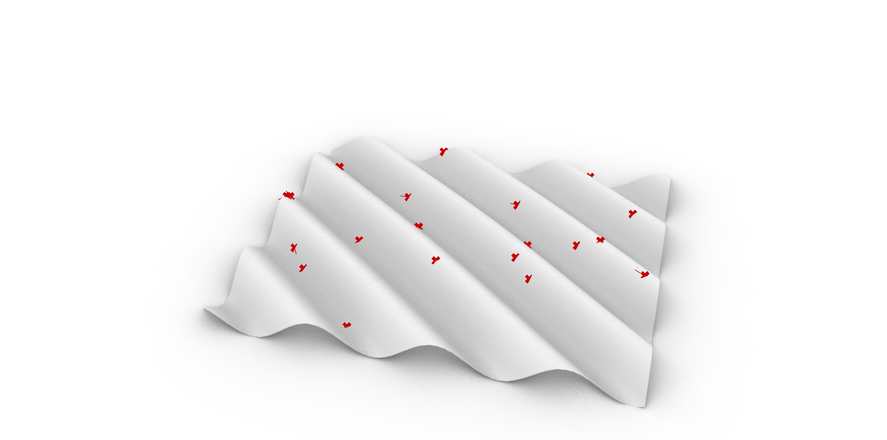
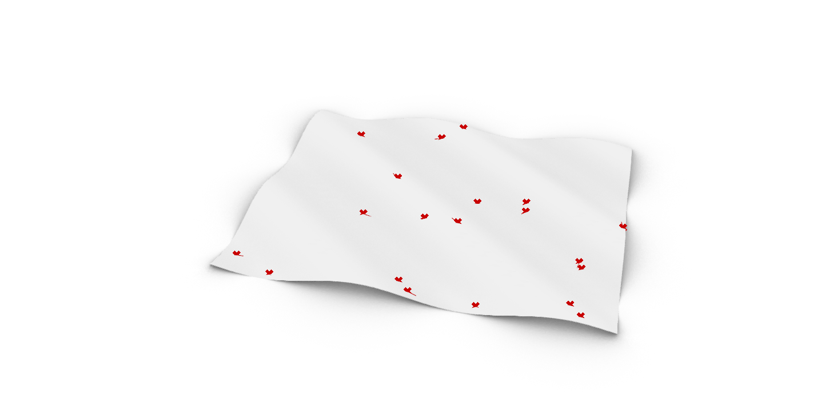
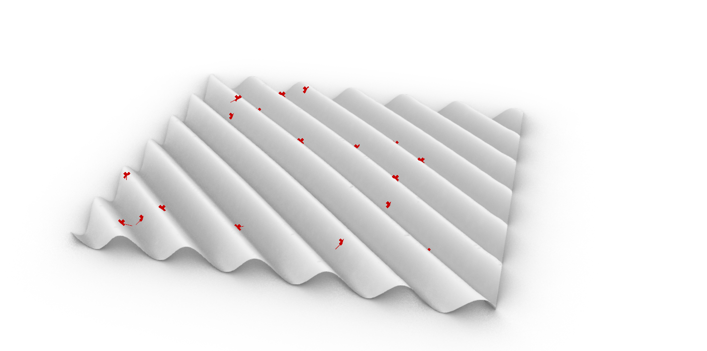

# Assignment 4: Agent-Based Modeling for Surface Panelization

[View on GitHub]({{ site.github.repository_url }})


## Table of Contents

- [Repository Structure](#repository-structure)
- [Project Overview](#project-overview)
- [Pseudo-Code](#pseudo-code)
- [Technical Explanation](#technical-explanation)
- [Design Variations](#design-variations)
- [Challenges and Solutions](#challenges-and-solutions)
- [AI Acknowledgments](#ai-acknowledgments)
- [References](#references)


---

## Repository Structure

```
A4/
├── index.md
├── README.md
├── BRIEF.md
├── agent_panelization.gh
├── surface_generator.py
├── agent_builder.py
├── agent_simulator.py
└── images/
    └── generated images
```
---

## Project Overview

The system starts from a deformed heightmap-based surface derived from a base NURBS surface, similar in logic to the Assignment 3 surface. A normalized UV grid is used to generate a scalar heightmap that displaces the surface along its normals, producing a continuous geometric field. The agents use two main geometric signals: a scalar field–derived slope (computed from heightmap gradients) and surface curvature (sampled directly from the underlying surface). These signals are intended to influence movement, with slope driving agents downhill across the surface and curvature modulating the strength and direction of this motion.

In principle, agent movement is governed by the combined influence of slope and curvature. The overall tessellation strategy remains grid-based, using either quad or triangular meshes derived from the UV subdivision of the surface. The agents are meant to move on top of this surface and produce paths, flows, or concentrations that one could later use as guidance for panelization decisions. However, in practice, the simulation failed after a single computation step: agents successfully spawned on the surface but did not continue moving over time. As a result, no dynamic agent-driven patterns emerged, and the intended flow-based structural logic remained unrealized.

---

## Pseudo-Code
Below, a detailed pseudo-code explaining the logic of the program is provided.

### 1. Module-Level Structure

Three modules were coded; `surface_generator.py`, `agent_builder.py` and `agent_simulator.py`. The code inside each module is explained in the following:

**Pseudo code for `surface_generator.py`**
```text
INPUTS:
  base_surface
  divU, divV
  amplitude, frequency, phase
  seed
  use_quad

PROCESS:
  ensure base_surface is Rhino.Geometry.Surface
    if GH wrapper -> unwrap
    if GUID -> coerce
    if not surface -> error

  set random seed

  U_grid, V_grid = generate_uv_grid(divU, divV)
    U_grid, V_grid are normalized arrays in [0,1]

  heightmap = compute_heightmap(U_grid, V_grid, amplitude, frequency, phase)
    heightmap = sinusoidal wave + radial Gaussian bump

  point_grid = sample_surface_points(base_surface, U_grid, V_grid)
    map normalized UVs to surface domain
    evaluate surface points

  displaced_points = displace_points_along_normals(
    point_grid,
    heightmap,
    base_surface
  )

  lifted_points = add_constant_z_offset(displaced_points, lift_value)

  output_surface = rebuild_surface_from_point_grid(lifted_points)

  if use_quad:
    output_mesh = build_quad_mesh_from_grid(lifted_points)
  else:
    output_mesh = build_tri_mesh_from_grid(lifted_points)

OUTPUTS:
  out_surface
  out_tessellation
  out_heightmap
  out_Ugrid
  out_Vgrid

```


**Pseudo code for `agent_builder.py`**
```text
class Agent:
  attributes:
    id
    position_3d
    velocity_3d
    uv_normalized          # (u, v) in [0,1]
    surface_reference
    heightmap_reference
    U_grid_reference
    V_grid_reference
    slope_weight
    curvature_weight
    age
    history

  method sense(heightmap, U_grid, V_grid):
    find nearest (i,j) index in grids to agent.uv
    compute slope using finite differences on heightmap
    slope_signal = slope * slope_weight

    find surface UV closest to agent.position
    compute surface curvature at UV
    curvature_signal = (k1 + k2) * curvature_weight

  method decide():
    sample surface slightly forward in U and V directions
    compute downhill vectors on surface
    combine U and V downhill vectors
    modulate combined vector using curvature_signal
    set velocity vector

  method move():
    update uv using velocity (scaled step)
    clamp uv to [0,1]
    update 3D position by evaluating surface at uv
    append position to history
    increment age

  method update():
    sense()
    decide()
    move()


function build_agents(n_agents, surface, heightmap, U_grid, V_grid, weights):
  agents = empty list

  for i in range(n_agents):
    sample random (u_norm, v_norm) in [0,1]
    map to surface domain
    evaluate surface -> position_3d
    assign small random initial velocity

    agent = Agent(
      id=i,
      position=position_3d,
      velocity=initial_velocity,
      surface=surface,
      slope_weight,
      curvature_weight
    )

    agent.uv = (u_norm, v_norm)
    agent.heightmap = heightmap
    agent.U_grid = U_grid
    agent.V_grid = V_grid

    add agent to list

  return agents


class MyComponent(GH_ScriptInstance):
  RunScript(inputs):
    unwrap and validate surface

    if reset OR agents do not exist yet:
      agents = build_agents(...)

    return agents

```

**Pseudo code for `agent_simulator.py`**
```text

IMPORT rhinoscriptsyntax
IMPORT scriptcontext

if "agents_storage" not in sticky:
  if agents input is None:
    sticky["agents_storage"] = empty list
  else:
    sticky["agents_storage"] = agents (ensure list)
else:
  if new agents input exists:
    overwrite sticky storage

agents_storage = sticky["agents_storage"]


if tick is True:
  for each agent in agents_storage:
    agent.update()

P = empty list
V = empty list


for each agent:
  add Rhino point at agent.position -> P
  compute endpoint = position + velocity
  add Rhino line from position to endpoint -> V

```

### 2. Main Simulation Loop

Here, the main simulation loop is described in pseudo-code. It covers the chronological execution to create the final outputs:

```text
INITIALIZATION:
  input base_surface
  generate deformed surface using heightmap
  generate U_grid, V_grid, and heightmap fields

  if reset is True or simulation starts:
    build N agents
    assign each agent:
      - random UV position on surface
      - reference to surface
      - reference to heightmap and UV grids
      - slope and curvature weights

MAIN SIMULATION LOOP (event-driven via tick):
  while simulation is running:
    if tick is triggered:
      for each agent:
        sense environment:
          - sample slope from heightmap at agent UV
          - sample surface curvature at agent position
        decide movement:
          - compute downhill direction from surface sampling
          - modulate velocity using curvature signal
        move:
          - update UV position
          - clamp to surface bounds
          - update 3D position on surface
          - store position in agent history

DATA RECORDING FOR VISUALIZATION:
  for each time step:
    record agent positions and trajectories
    visualize:
      - agent points (current positions)
      - velocity vectors (direction and magnitude)

  (intended but not fully realized)
  use agent paths, densities, or flow directions to:
    - inform panel orientation
    - influence subdivision density
    - guide surface tessellation logic

```

### 3. Agent Class / Classes
This section explicitly covers "what an agent is and what it can do". It is structured in two sub-sections; *Attributues* and *Methods*


- **Attributes**:
Each agent stores both geometric state and behavioral parameters in the following way:

  - `uv` (normalized): the agent’s position in UV space, constrained to [0,1].

  - `position`: the agent’s current 3D position on the surface.

  - `velocity`: a 3D movement vector derived from surface sampling.

  - `surface`: reference to the underlying surface.

  - `heightmap`, `U_grid`, `V_grid`: shared environmental fields used for sensing.

  - `slope_weight`, `curvature_weight`: scalar parameters controlling behavioral response.

  - `age`: time-step counter.

  - `history`: list of past positions for trajectory tracking.

  - `id`: unique identifier for each agent.


- **Methods**:
  - `sense_fields(heightmap, U_grid, V_grid)`: Samples geometric signals at the agent’s current location. The local slope is computed from heightmap gradients in UV space, while surface curvature is sampled directly from the surface at the agent’s position. These signals are scaled by user-defined weights (sliders) and stored internally.

  - `decide()`: Computes the agent’s velocity based on sensed signals. The agent samples the surface slightly ahead in the U and V directions to estimate downhill movement. Curvature modulates this movement by amplifying or dampening the slope-based direction, resulting in a combined velocity vector.

  - `move()`: Updates the agent’s UV position based on the velocity vector, clamps it to the valid surface domain, and re-evaluates the corresponding 3D position on the surface. The new position is appended to the agent’s history and the agent’s age is incremented.

  - `update()`: Executes one full simulation step by calling `sense_fields()`, `decide()`, and `move()` in sequence.


### 4. Panelization / Geometry Generation

Panelization in this project is primarily surface-driven rather than agent-driven. The base surface is subdivided in UV space using a regular grid, and this grid is used to generate either a quad or triangular mesh. The resulting mesh directly defines the panel layout, with mesh vertices sampled from the deformed heightmap-based surface as done in assignment 3.

Agent simulation data was not directly converted into panel geometry. Agents were intended to move across the surface and generate trajectories or flow patterns that could influence panel density, orientation, or subdivision logic—for example by increasing subdivision where agents concentrate or aligning panels along dominant flow directions. However, due to a failure in the simulation loop after the initial computation, agents did not produce time-based trajectories and therefore could not meaningfully affect the tessellation. The attempted panelization code was deleted as it never became relevant.

As a result, geometric signals such as slope and curvature do not influence panelization and panel topology remains fixed (quad or triangular). Unfortunately, agent data functions only as a conceptual layer rather than an active driver of geometry generation.

A fictional pseuod-code could be the following:

```text
generate surface and mesh from UV grid

if agent simulation were active:
  for each agent:
    record position history
  analyze agent density / flow directions
  modify panel density or orientation based on agent data
else:
  use static UV-based mesh as final panelization

``` 

---

## Technical Explanation

### 1. Overall Pipeline

The pipeline consists of five main stages. First, a deformed surface is generated procedurally from a base surface using a heightmap (`surface_generator.py`). This process also produces scalar fields and UV grids that define the simulation environment. Second, geometric signals such as slope (derived from the heightmap) and curvature (derived from the surface) are made accessible to agents. Third, agents are initialized and distributed randomly across the surface in UV space (`agent_builder.py`). Fourth, a time-based simulation is intended to advance agent behavior using a tick-driven update loop (`agent_simulator.py`). Finally, geometry for visualization and panelization is produced, primarily through a grid-based mesh derived directly from the surface.

### 2. Surface Generation and Fields

The surface is generated using a heightmap-based approach similar to Assignment 3. A normalized UV grid is constructed and used to evaluate a sinusoidal wave combined with a radial Gaussian bump, producing a scalar heightmap stored as a 2D NumPy array. This heightmap is applied as a normal displacement to the base surface, after which a new surface and either a quad or triangular mesh are rebuilt from the displaced point grid.

Two primary fields are used. The heightmap itself functions as a scalar field from which slope is computed via finite differences. Surface curvature is computed on demand using Rhino’s surface curvature evaluation. Fields are represented implicitly: the heightmap as a `(H, W)` array, and curvature as a locally sampled value per agent rather than a full grid. Agent UV coordinates in the range `[0,1]` are mapped to grid indices by finding the nearest index in the U and V coordinate arrays.

### 3. Geometric Signals and Agent Behaviors

Two geometric signals drive agent behavior: **slope** and **curvature**.
Slope is derived from the heightmap gradient and represents surface steepness. Agents are designed to follow downhill directions by sampling nearby surface points and estimating steepest descent. Curvature is sampled directly from the surface at the agent’s position and is used to modulate movement strength, either amplifying or dampening slope-driven motion depending on local surface bending.

These signals are combined using weighted sums. Slope primarily determines direction, while curvature acts as a modifier on velocity magnitude and stability. No explicit vector field or distance-based attractors are implemented beyond these surface-derived signals. They were to be implemented later, but was not included due to the malfunction of the code. The combination of signals is continuous and rule-based rather than "threshold"-driven.


### 4. Simulation and Panelization Strategy

The simulation is intended to advance one step per tick, with no predefined stopping criterion. Each step consists of sensing geometric signals, computing velocity, and updating position. In practice, the simulation failed after the initial computation step, meaning agents spawned correctly on the surface but did not continue moving over time. A "Button" component inside GH was used instead of a "Trigger" to attempt to control the number of recomputations. Had the code been succesfull, a "Trigger" component would have been implemented.

### 5. Multi-Module Design

The project is split into multiple modules to separate concerns clearly. `surface_generator.py` handles geometry creation and field generation. `agent_builder.py` is responsible for defining agent behavior and managing persistent agent initialization. `agent_simulator.py` advances the simulation in time and handles visualization. This modular structure was chosen to keep surface logic, agent logic, and simulation control independent, allowing each part to be developed and debugged separately, even though the full feedback loop was not successfully completed. Even though the code did not run succesfully, debugging was significantly easier by splitting the project into multiple modules. 

---

## Design Variations

Below, three different design variations are shown. The signals and parameters are described in the section "Parameter and Signal Table". The images were rendered using the "Arctic" option in Rhino. Surface tessellation is only produced by the module `surface_generator` and a wireframe-rendering will show quad and tri-elements. 
The images clearly show that the agents succesfully spawn on the surface.

**Variation A**


**Variation B**


**Variation C**



For reference, a wireframe rendering of variation C is pasted below:


### Parameter and Signal Table

| Design  | Amplitude, frequency, phase, seed | Number of agents |
|----------|----------|----------|
| A | 1.0, 3.5, 1.0, 30  | 20  |
| B | 0.5, 2.0, 0.1, 50  | 20 | 
| C | 0.85, 6.0, 0.5, 80  | 20 |

### Variation A:
- **Signals Used**: Curvature + slope
- **Parameters Changed**: See table above
- **Description**: The relatively high amplitude and mid-range frequency produce a pronounced but smooth surface deformation, resulting in clear ridges and valleys. This creates stronger slope signals across the surface, which would encourage agents to follow downhill paths more distinctly. Curvature variations are moderate, leading to smoother modulation of movement. The resulting panelization emphasizes continuous surface flow, with panels reflecting the overall heightmap structure rather than sharp local variation.

### Variation B:
- **Signals Used**: Curvature + slope
- **Parameters Changed**: See table above
- **Description**: Lower amplitude and frequency generate a smoother and more gently undulating surface with reduced slope and curvature contrasts. As a result, agent movement would be slower and less directional, with weaker attraction toward valleys and minimal curvature-driven modulation. The panelization remains more uniform, with fewer visually pronounced features and a more evenly distributed tessellation.

### Variation C:
- **Signals Used**: Curvature + slope
- **Parameters Changed**: See table above
- **Description**: The high frequency introduces rapid surface oscillations, creating dense alternations between ridges and valleys and stronger local curvature changes. This increases the intensity and variability of slope signals, which would lead to more reactive and locally constrained agent trajectories. The panelization reflects this complexity through tighter geometric variation and a more fragmented surface articulation, emphasizing high-frequency surface features.


## Challenges and Solutions

This assignment proved very difficult, and unfortunately I was not able to produce a final pleasing outcome. In this section, some of the key challenges (and solutions) of the assignment are presented.

- Challenge 1: Agent simulation stopped after the initial computation, resulting in agents spawning but not moving over time.
- Solution 1: Diagnosed the issue by isolating the update loop and correcting incorrect assumptions about RhinoScriptSyntax return types; although some errors were fixed, the simulation remained unstable and agent-driven behavior could not be fully realized.
 <p></p>

- Challenge 2: Agent behavior could not be meaningfully tuned due to the lack of continuous simulation steps.
- Solution 2: Focus shifted from behavioral tuning to ensuring correct agent initialization and clear documentation of intended behavior.
 <p></p>

- Challenge 3: Panelization did not respond to agent behavior and remained static.
- Solution 3: Accepted a surface-driven tessellation and clearly documented the intended but unrealized agent-to-panel feedback loop.
 <p></p>

- Challenge 4: Managing persistence and data flow between Grasshopper, GhPython, and Rhino geometry was complex and error-prone.
- Solution 4: Used GH_ScriptInstance and scriptcontext.sticky to maintain agent state across recomputations, while carefully controlling reset logic.


- Challenge 5: Difficulty getting agents to appear and persist in Grasshopper due to uncertainty around `GH_ScriptInstance usage` and agent persistence.
- Solution 5: Diagnosed the issue by comparing the implementation against provided templates and isolating persistence logic; while `GH_ScriptInstance` was later reintroduced correctly, early errors and deviations contributed to agents not appearing or behaving as expected. This limitation is documented transparently in this file.


---

## AI Acknowledgments

During the development of this assignment, I used ChatGPT as a support tool for debugging and clarification.

Specifically, ChatGPT was used to:

- Interpret and explain Python error messages encountered during development

- Help reason about Grasshopper-specific concepts such as GH_ScriptInstance

- Provide explanations of code structure and logic of the codes provided in week 11.

Below, the prompts given to ChatGPT are shown:

**Full code explanation of week 11 demo**
```
"Below i have inserted the code from my Advanced computational design class. It has two modules and the following inputs and outputs"

Inputs and outputs given
Code given for the two modules

"Please explain the code for the two components line-by-line, so that I completely understand it"
```

**Explanation of UV-space and Rhino surface domain**
```
"Can you explain the difference between normalized UV space and the actual surface domain in Rhino? How do i convert values back and forth?"
```

**Explanation of GH_ScriptInstance**
```
"“I am getting this error in a Grasshopper Python".

Pasted error

"Can you explain what GH_ScriptInstance does and when it should be used?”
```

**Final attempt to debug code**
```
"This is my code"

Inserted code

"My agents are spawning, but at every recomputation I get this error:"

Inserted error

"Can you help me? Something is clearly wrong."
```

#### General
The prompts given above are examples of where I have used AI for some of the bigger challenges in my code. Like in assignment 3, it is needless to say that I have asked ChatGPT for other minor questions and especially follow-up questions when it provided answers I did not understand.

Sometimes ChatGPT provided answers I simply did not understand, and I chose not to implement these suggested changes.

---

## References

- **ChatGPT**

- **General Rhino support:**
  - Rhino common: https://developer.rhino3d.com/api/rhinocommon/

- **Python in Rhino and Grasshopper:**
  - RhinoScriptSyntax: https://developer.rhino3d.com/api/RhinoScriptSyntax/

  - Numpy: https://numpy.org/doc/2.1/index.html

- **Slides from class:**
  - Slides from week 11

- **YouTube:**
  - Various tutorials that provided absolutely no help at all 